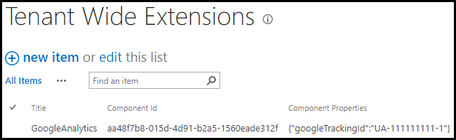

## Google Analytics for SharePoint

Deploy Google Analytics to all modern sites in your SharePoint Online tenant using a SharePoint Framework extension.

## Setup
### Pre-requisites
- App Catalog: Ensure the [App Catalog](https://docs.microsoft.com/en-us/sharepoint/use-app-catalog) is setup in your SharePoint Online tenant

### Installation
1. Download the SPFx package [googleanalytics-tenant.sppkg](https://github.com/bschlintz/spfx-googleanalytics-tenant/blob/master/sharepoint/solution/googleanalytics-tenant.sppkg) file from Github (or clone the repo and build the package yourself)
2. Upload sppkg file to the 'Apps for SharePoint' library in your Tenant App Catalog
3. Click the 'Make this solution available to all sites in your organization' checkbox and then click Deploy

### Configuration
This solution is deployed using [Tenant Wide Extensions](https://docs.microsoft.com/en-us/sharepoint/dev/spfx/extensions/basics/tenant-wide-deployment-extensions). You can modify the JSON properties configuration via the item in the Tenant Wide Extensions list. The available properties are below.

| Property Name       | Default Value | Description |
| ------------------- | ------------- | ----- |
| googleTrackingId | `""` | Google Analytics Tracking ID. Example: UA-111111111-1 |

## Updates
Follow the same steps as installation. Overwrite the existing package in the 'Apps for SharePoint' library when uploading the new package. 

> __Tip #1__: Be sure to check-in the sppkg file after the deployment if it is left checked-out.

> __Tip #2__: Ensure there aren't duplicate entries in the Tenant Wide Extensions list after deploying an update. Delete any duplicates if there are any.

## Removal

### Uninstall from Tenant
1. Delete the entry in the Tenant Wide Extensions list on the Tenant App Catalog titled `GoogleAnalytics`.
2. Delete the `googleanalytics-tenant.sppkg` file from the 'Apps for SharePoint' library in your Tenant App Catalog.

## Disclaimer

Microsoft provides programming examples for illustration only, without warranty either expressed or implied, including, but not limited to, the implied warranties of merchantability and/or fitness for a particular purpose. We grant You a nonexclusive, royalty-free right to use and modify the Sample Code and to reproduce and distribute the object code form of the Sample Code, provided that You agree: (i) to not use Our name, logo, or trademarks to market Your software product in which the Sample Code is embedded; (ii) to include a valid copyright notice on Your software product in which the Sample Code is embedded; and (iii) to indemnify, hold harmless, and defend Us and Our suppliers from and against any claims or lawsuits, including attorneys' fees, that arise or result from the use or distribution of the Sample Code.
